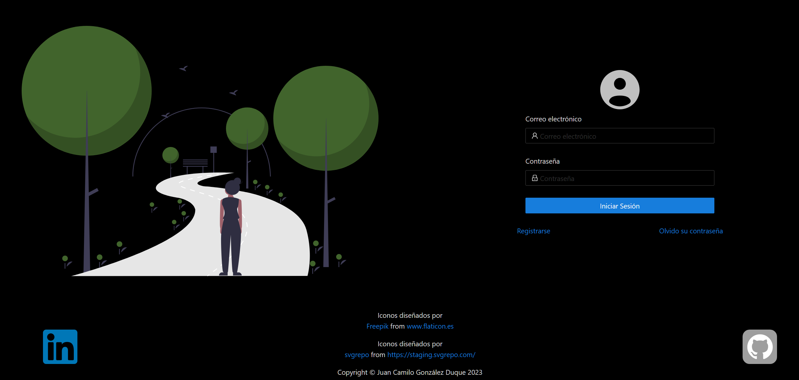

# Proyecto en Angular V.16 CLI
# Temática: User Management
## Estado del Proyecto: En Desarrollo.

Este repositorio contiene un proyecto práctico sobre Angular V.16, que permite efectuar acciones de tipo `CRUD`
sobre la información a manipular, el cual se divide en 2 ramas `main` y `develop`.

[//]: <> (Adicionalmente el proyecto cuenta con 2 ambientes, el de `Producción` y `Desarrollo`.)

## Estructura del Proyecto

La estructura del proyecto se diseño teniendo en consideración las mejores prácticas de organización de un proyecto Angular, quedando su estructura de la siguiente manera:
* src: contiene el código fuente de la aplicación.
* src/app: contiene los componentes, servicios, pipes, utilidades y directivas principales de la aplicación.
* src/app/services: contiene todos los servicios de la aplicación.
* src/app/interfaces: contiene todas las interfacez en la aplicación.
* src/app/utils: contiene todos los interceptores y otras cosas más de la aplicación.
* src/app/module: contiene todos los módulos en la aplicación.
* src/app/module/xyz: contienen los componentes y otros elementos que conforman la aplicación.

## Tecnologías Utilizadas

Se utilizan las siguientes herramientas:
* HTML
* CSS
* JavaScript
* TypeScript
* Angular V.16
* NgZorro V.16.2.2

## Ramas

### `main`

La rama `main` se utiliza solo para proporcionar información básica del repositorio,
en este caso el archivo `README`.

### `develop`

En la rama `develop` encontrarás el proyecto de Angular, el cual gestiona usuarios. Incluye la creación de menús para las pantallas a las que pueden acceder, así como otras funcionalidades como la creación de usuarios, asignación de permisos y la actualización de su información de contacto, entre otras.

Cabe mencionar que el proyecto ya tiene configurado 2 ambientes, correspondientes a `environment.ts`(si se despliega a producción tomaría este archivo) y `environment.development.ts`(al desplegarlo en modo desarrollo toma este archivo).

## Instrucciones de Ejecución

### Rama Develop

Para poner en ejecución el proyecto de la presente rama se requieren los siguientes items:
* Git instalado para clonar el repositorio remoto en la máquina local.
* NodeJS instalado, para descargar las dependencias que utilice el proyecto definidas en el archivo package.json.
* Clonar el repositorio: `https://github.com/JuanCamiloDevFrontBack/user-management.git`.

### Pasos para Poner en Ejecución la Aplicación

Ejecutar los siguientes comandos:
1. `git clone https://github.com/JuanCamiloDevFrontBack/user-management-front.git`.
2. `npm i` ó `npm install`.
3. Poner en ejecución el proyecto del repositorio: `https://github.com/JuanCamiloDevFrontBack/user-management.git`, de momento esta en desarrollo.
4. Levantar la aplicación con: `npm run start-dev` ó `npm run start-dev-mobile` si se quiere probar desde un dispositivo móvil directamente(inactivar el firewall para probar en móvil).
5. Abrir en el navegador la siguiente url: `http://localhost:5000/` ó `http://ip_equipo:5000/` al probarlo en móvil.
